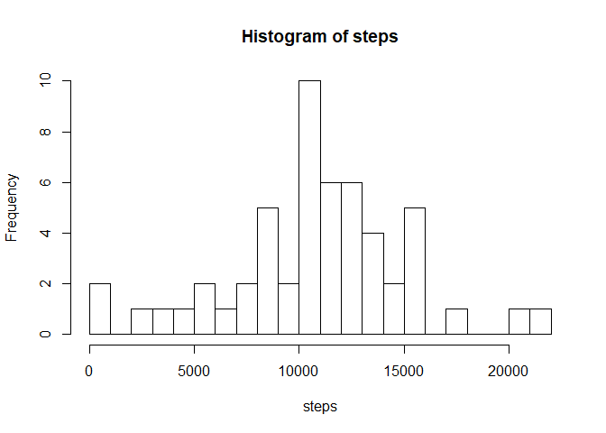
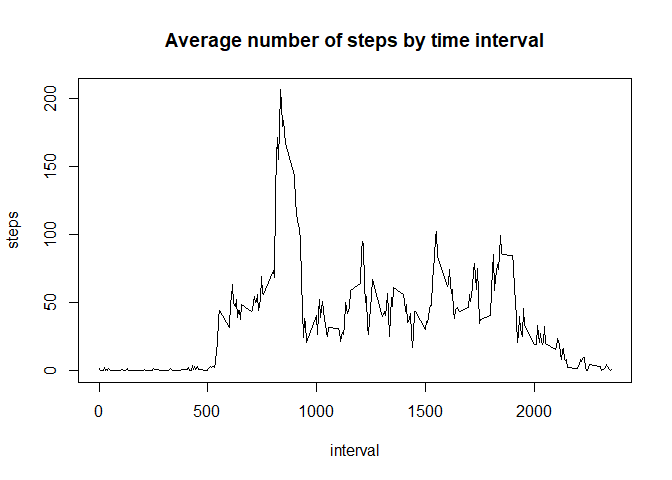
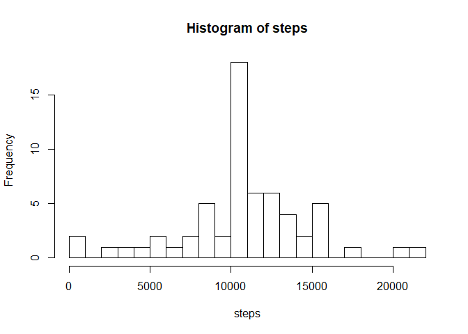
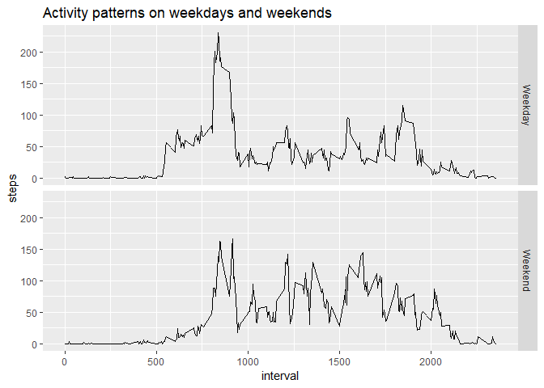

## Loading and preprocessing the data

Read data and examine its structure

```r
activity <- read.csv("activity.csv")
str(activity)
```

```
## 'data.frame':	17568 obs. of  3 variables:
##  $ steps   : int  NA NA NA NA NA NA NA NA NA NA ...
##  $ date    : Factor w/ 61 levels "2012-10-01","2012-10-02",..: 1 1 1 1 1 1 1 1 1 1 ...
##  $ interval: int  0 5 10 15 20 25 30 35 40 45 ...
```

Load relevant libraries

```r
library(dplyr)
```

## What is mean total number of steps taken per day?

For the first part of the analysis, we **ignore all missing values** in the dataset.


```r
activity_nonmissing <- subset(activity, !is.na(steps))
```

We construct a **histogram** of the number of steps taken each day as follows:


```r
daily_steps <- aggregate(steps~date, activity_nonmissing, sum)
with(daily_steps, hist(steps, breaks=25))
```

<!-- -->

The **mean** and **median** number of steps per day can be calculated in the following manner:

```r
mean(daily_steps$steps)
```

```
## [1] 10766.19
```

```r
median(daily_steps$steps)
```

```
## [1] 10765
```

## What is the average daily activity pattern?

To aggregate the average number of steps by time interval and make a **time series plot** of the 5-minute interval (x-axis) and the average number of steps taken, averaged across all days (y-axis)

```r
steps_byinterval <- aggregate(steps~interval, activity_nonmissing, mean)
plot(steps_byinterval, type="l", main="Average number of steps by time interval")
```

<!-- -->

Which interval (on average) contains the **maximum** number of steps?

```r
filter(steps_byinterval, steps==max(steps))
```

```
##   interval    steps
## 1      835 206.1698
```

## Imputing missing values

Calculate and report the total number of missing values in the dataset

```r
nrow(subset(activity, is.na(steps)))
```

```
## [1] 2304
```

Replace missing data by average number of steps for that interval

```r
filled <- transform(activity, 
                    steps = ifelse(is.na(steps), 
                                   steps_byinterval$steps[match(activity$interval, steps_byinterval$interval)],
                                   activity$steps))
daily_new <- aggregate(steps~date, filled, sum)
```

Create new histogram and calculate the new mean/median

```r
with(daily_new, hist(steps, breaks=25))
```

<!-- -->

```r
mean(daily_new$steps)
```

```
## [1] 10766.19
```

```r
median(daily_new$steps)
```

```
## [1] 10766.19
```
Comments: The mean does not change since we are populating the missing values with mean values. The median is now equal to the mean.

## Are there differences in activity patterns between weekdays and weekends?

Create a factor variable to indicate if a date is a weekend or weekday

```r
filled$day <- weekdays(strptime(filled$date, "%Y-%m-%d"))
filled$weekday <- ifelse(filled$day %in% c("Saturday","Sunday"), "Weekend", "Weekday")
steps_comparison <- aggregate(steps~interval+weekday, filled, mean)
```

Make panel plot of average number of steps at each time interval, for weekend and weekday respectively

```r
library(ggplot2)
ggplot(steps_comparison, aes(x=interval, y=steps)) + geom_line() + 
  facet_grid(weekday ~ .) +
  labs(title="Activity patterns on weekdays and weekends")
```

<!-- -->
